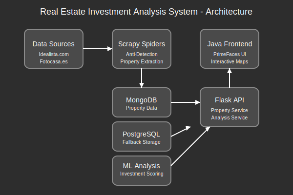

# Real Estate Investment Analysis System

Este sistema consta de dos componentes principales:

1. **Scraper Python**: Extrae datos de propiedades de sitios web inmobiliarios españoles (idealista.com, fotocasa.es, etc.), los almacena en MongoDB, realiza seguimiento de los cambios, y usa machine learning para identificar oportunidades de inversión.

2. **Frontend Java PrimeFaces**: Muestra oportunidades de inversión en mapas interactivos basados en las regiones seleccionadas.

## Arquitectura del Sistema



## Componentes

### 1. Módulo Scraper

- **Spiders**: Implementados con Scrapy para extraer datos de diferentes portales inmobiliarios.
- **Middleware**: Sistemas de rotación de proxies y user-agents para evitar bloqueos.
- **Pipelines**: Procesamiento y análisis de los datos extraídos.
- **Machine Learning**: Análisis de potencial de inversión basado en datos históricos y comparativos.

### 2. Módulo API

- **API REST**: Implementada con Flask para proporcionar acceso a los datos.
- **Servicios**: Recuperación de propiedades, análisis de inversión, etc.
- **Adaptador PostgreSQL**: Sistema de fallback cuando MongoDB no está disponible.

### 3. Módulo Frontend

- **Java PrimeFaces**: Interfaz de usuario rica e interactiva.
- **Mapas Interactivos**: Visualización geoespacial de propiedades.
- **Filtros**: Por ciudad, barrio, precio, tamaño, etc.

## Características

- Web scraping con técnicas anti-detección
- Seguimiento de nuevas propiedades y modificaciones
- Análisis de oportunidades de inversión
- Mapas interactivos con ubicaciones de propiedades
- Filtrado por ciudad, barrio, precio, etc.

## Requisitos

- Python 3.8+
- Java 11+
- MongoDB
- PostgreSQL (como respaldo)
- Maven

## Instalación

1. **Backend Flask y Scraper**:
   ```
   pip install -r requirements.txt
   ```

2. **Frontend Java**:
   ```
   cd java-frontend
   mvn clean install
   ```

## Configuración

1. **MongoDB**:
   - Asegúrate de tener una instancia de MongoDB ejecutándose.
   - Configura las credenciales en un archivo `.env`.

2. **PostgreSQL** (opcional):
   - Configura las credenciales en el mismo archivo `.env`.

## Ejecución

1. **Scraper**:
   ```
   python scraper/main.py
   ```

2. **API**:
   ```
   python main.py
   ```

3. **Frontend Java**:
   ```
   cd java-frontend
   mvn tomcat:run
   ```

## Características de Anti-detección

- Rotación de proxies
- Rotación de user-agents
- Gestión de cookies y sesiones
- Patrones de navegación realistas

## Licencia

MIT

## Autor

[Tu nombre]